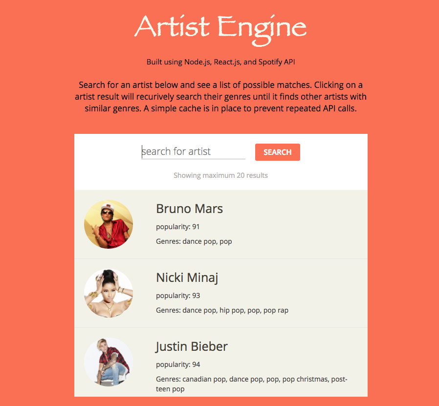

# Artist Engine



Built using Node.js, React.js, and Spotify API

Search for an artist below and see a list of possible matches. Clicking on a artist result will recurively search their genres until it finds other artists with similar genres. A simple cache is in place to prevent repeated API calls.

## Install

Step 1: Download/clone.
```
git clone https://github.com/cyspath/artist_engine.git
```
Step 2: Install dependencies.
```
npm install
```
Step 3: Start server.
```
npm start
```
Step 4: Open http://localhost:3000/ in your browser.
